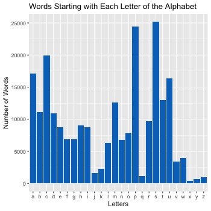

```{r load-data}

alphabetTable <- read.csv("alphabetTable.csv")
#this is all screwed up. Need to write the table properly -> figure out how to get rid of the other column.

```

```{r analyze-data}

#Then create code that will pick the row the highest number in the 'alphaCount' column. And return that

#names(data)
#df[which.max(data$count),]

#letter.with.most.words <- data$count[which.max(data$count)]
```

The most common English word length is `r letter.with.most.words`.